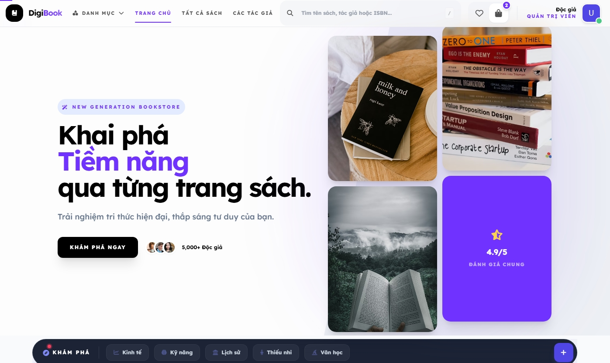
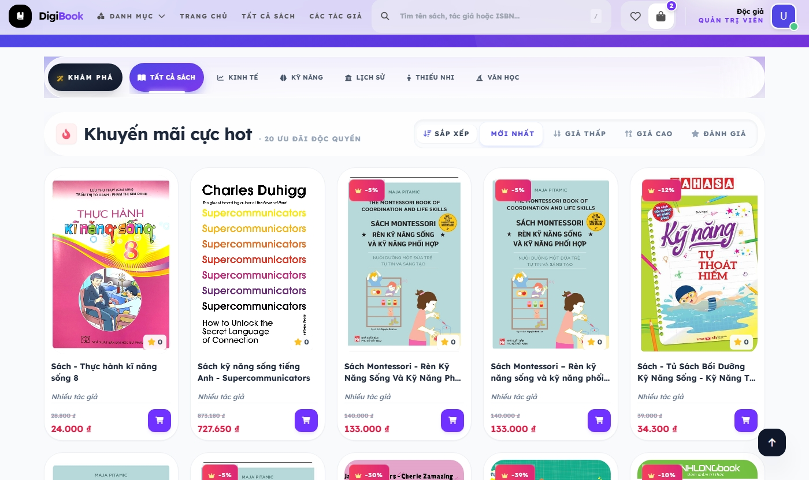
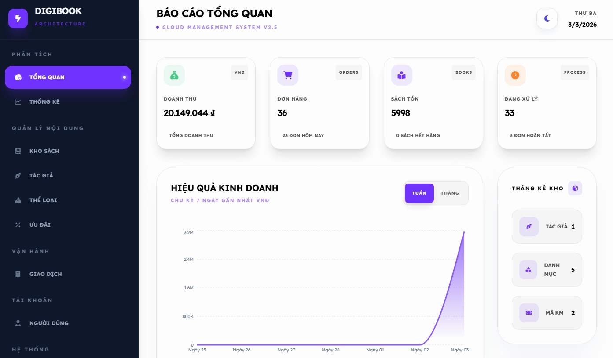

# 📚 DigiBook - Modern Bookstore Application
<!-- Đã tích hợp API Render: https://api-digibook-j3sv.onrender.com -->

<div align="center">


**Ứng dụng nhà sách trực tuyến với kiến trúc Feature-Based, tối ưu hiệu năng và bảo mật**

[🔗 Live Demo](https://tienxdun.github.io/DigiBook/) • [📖 Documentation](./DOCS) • [🐛 Report Bug](https://github.com/tienxdun/DigiBook/issues) • [✨ Request Feature](https://github.com/tienxdun/DigiBook/issues)

</div>

---

## 📚 Documentation

Tài liệu cốt lõi trong **[DOCS/](./DOCS)**:

- 🚀 **[INSTALLATION.md](./DOCS/INSTALLATION.md)** - Setup nhanh
- 🏗️ **[ARCHITECTURE.md](./DOCS/ARCHITECTURE.md)** - Kiến trúc & cấu trúc
- 📖 **[API.md](./DOCS/API.md)** - API reference
- 🛠️ **[DEVELOPMENT.md](./DOCS/DEVELOPMENT.md)** - Coding conventions & git workflow
- 🗄️ **[DATABASE_SCHEMA.md](./DOCS/DATABASE_SCHEMA.md)** - Firestore schema

---

## 🎯 Tổng Quan

**DigiBook** là E-commerce platform chuyên về sách, xây dựng với **React 19**, **TypeScript**, **Firebase** và **Vite**. Dự án áp dụng kiến trúc Feature-based, Service Layer Pattern và các best practices hiện đại.

### ✨ Highlights

- 🚀 **React 19** - Concurrent Rendering, Automatic Batching
- 🔥 **Firebase** - Firestore, Authentication, Cloud Storage
- ⚡ **Vite 6.2** - Fast build, HMR, Code Splitting
- 📦 **Feature-Based Architecture** - Scalable & Maintainable
- 🔐 **Role-Based Access Control** - Admin & User separation
- 📊 **Real-time Dashboard** - Analytics với Recharts
- 🧪 **Unit Testing** - Vitest + React Testing Library (85%+ coverage)

---

## 📸 Giao Diện Ứng Dụng

<div align="center">
  <table width="100%">
    <tr>
      <td width="33.33%" align="center">
        <a href="./DOCS/Home.jpeg">
          
        </a>
        <br><b>🏠 Trang Chủ</b>
      </td>
      <td width="33.33%" align="center">
        <a href="./DOCS/Category.jpeg">
          
        </a>
        <br><b>📚 Danh Mục</b>
      </td>
      <td width="33.33%" align="center">
        <a href="./DOCS/AdminDashboard.jpeg">
          
        </a>
        <br><b>📊 Admin Dashboard</b>
      </td>
    </tr>
  </table>
</div>


---

## 🏗️ Kiến Trúc

### Tech Stack

**Frontend Core**
- React 19.2 + TypeScript 5.8 + Vite 6.2
- React Router 6.22 + Context API
- Tailwind CSS 3.4 + Framer Motion

**Backend & Database**
- Firebase 12.8 (Firestore + Auth + Storage)
- Serverless Architecture

**Key Libraries**
- Recharts (Analytics), React Leaflet (Maps)
- React Hot Toast, React Helmet (SEO)

### Cấu Trúc Dự Án

```
src/
├── features/           # Feature modules (admin, auth, books, cart, orders)
├── services/           # Business logic (db/, errorHandler.ts, map.ts)
├── shared/             # Reusable (components/, hooks/, types/, utils/)
└── layouts/            # Page layouts (Header, Footer, AdminLayout)
```

**Pattern chính:**
- **Feature-Based**: Mỗi feature độc lập với components/contexts/pages
- **Service Layer**: Centralized database operations trong `services/db/modules/`
- **Separation of Concerns**: Components (UI) ↔ Contexts (State) ↔ Services (API)

---

## 🚀 Tính Năng

### User Features
- 🔍 **Search & Filter** - Tìm kiếm theo sách/tác giả/ISBN, lọc theo category/giá
- 📖 **Book Management** - Chi tiết sách, Quick View Modal, Wishlist, Reviews
- 🛒 **Shopping Cart** - Realtime cart, Coupon system, OpenStreetMap integration
- 📦 **Order Tracking** - Realtime status updates, order history

### Admin Features  
- 📊 **Analytics Dashboard** - Doanh thu, bestsellers, order monitoring
- 📚 **Content Management** - CRUD cho Books, Authors, Categories, Users, Orders, Coupons
- 🔍 **System Logs** - Audit trail, error tracking, activity monitoring
Quick Start

```bash
# Clone & Install
git clone https://github.com/tienxdun/DigiBook.git
cd DigiBook
npm install

# Configure Firebase (.env)
VITE_FIREBASE_API_KEY=your_api_key
VITE_FIREBASE_AUTH_DOMAIN=your_auth_domain
VITE_FIREBASE_PROJECT_ID=your_project_id
VITE_FIREBASE_STORAGE_BUCKET=your_storage_bucket
VITE_FIREBASE_MESSAGING_SENDER_ID=your_sender_id
VITE_FIREBASE_APP_ID=your_app_id

# Run
npm run dev          # Development (localhost:5173)
npm run build        # Production build
npm run preview      # Preview production build
npm run test         # Run tests
```

**📖 Xem hướng dẫn chi tiết tại [INSTALLATION.md](./DOCS/INSTALLATION.md)**
```bash
# Clone & Install
git clone https://github.com/yourusername/DigiBook.git
cd DigiBook
npm install

# Configure Firebase (.env)
VITE_FIREBASE_API_KEY=your_api_key
VITE_FIREBASE_AUTH_DOMAIN=your_auth_domain
VITE_FIREBASE_PROJECT_ID=your_project_id
# ... other Firebase configs

# Run
npm run dev          # Development (localhost:3000)
npm run build        # Production build
npm run test         # Run tests
```

---

## 🎓 Technical Highlights

### Performance
- ⚡ **Code Splitting** - Lazy loading với React.lazy()
- ⚡ **Memoization** - React.memo() cho component optimization
- ⚡ **Bundle Optimization** - Vite tree shaking & minification

### Best Practices
- ✅ **TypeScript Strict Mode** - Type-safety toàn project
- ✅ **Error Boundaries** - Graceful error handling
- ✅ **Centralized Logging** - System logs cho critical operations
- ✅ **Protected Routes** - Authentication guards
- ✅ **Responsive Design** - Mobile-first với Tailwind

**📖 Đọc [DEVELOPMENT.md](./DOCS/DEVELOPMENT.md) để biết coding conventions và git workflow**

---

## 📝 License

Dự án này được phát hành dưới giấy phép **MIT License**. Xem file [LICENSE](./LICENSE) để biết thêm chi tiết.

---

## 📞 Liên Hệ & Hỗ Trợ

- **GitHub Repository**: [https://github.com/tienxdun/DigiBook](https://github.com/tienxdun/DigiBook)
- **Live Demo**: [https://tienxdun.github.io/DigiBook/](https://tienxdun.github.io/DigiBook/)
- **Issues**: [GitHub Issues](https://github.com/tienxdun/DigiBook/issues)
- **Documentation**: [./DOCS](./DOCS)

---

<div align="center">

**DigiBook** - Modern Bookstore Application

*Cập nhật lần cuối: January 2026*

